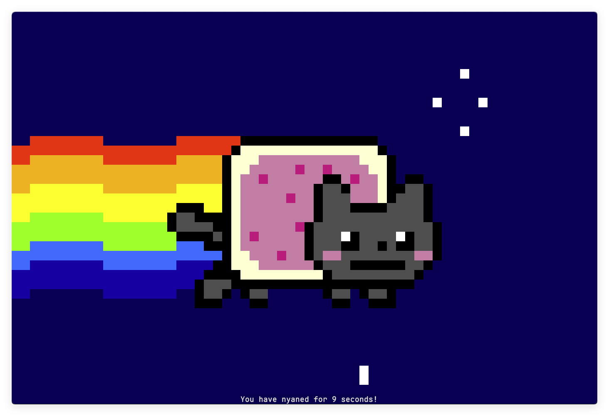

# Nyancat

Nyancat!




## Features

- Supports both telnet and HTTP modes.

## Usage

Run in terminal.

```bash
./nyancat
```

Run as telnet server.

```bash
./nyancat -t
```

Then connect to it.

```sh
telnet localhost
```

Run as web server

```sh
./nyancat -H
```

Open in browser `http://localhost:3000`

## Options

- `--telnet`: Enable telnet mode.
- `--no-counter`: Disable the counter.
- `--no-clear`: Disable the screen clearing.
- `--frames <FRAMES>`: Exit after rendering the specified number of frames.
- `--port <PORT>`: Telnet server port.
- `--http`: HTTP mode.

## License

This project is licensed under the MIT License.
