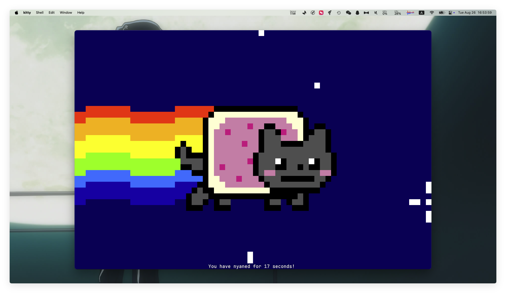

# Nyancat

Nyancat is a simple ASCII animation.




## Usage

```bash
./nyancat
```

### Telnet

```bash
./nyancat -t
```

### Options

- `--telnet`: Enable telnet mode.
- `--no-counter`: Disable the counter.
- `--no-clear`: Disable the screen clearing.
- `--frames <FRAMES>`: Exit after rendering the specified number of frames.
- `--port <PORT>`: Telnet server port.

## License

This project is licensed under the MIT License.
